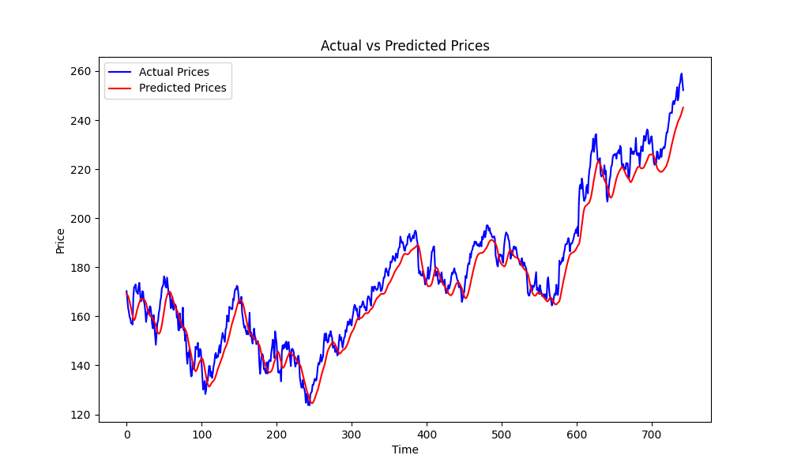
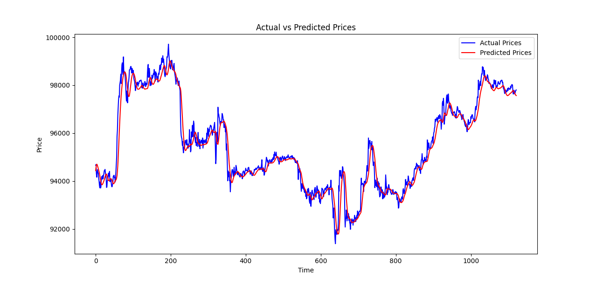

# LSTM Stock and BTC Price Prediction

## Overview
This project implements Long Short-Term Memory (LSTM) models to predict **AAPL stock prices** based on historical closing prices and **BTC-USD prices** on a **15-minute timeframe**. The models are trained using Python and TensorFlow, focusing on preprocessing financial data, building robust LSTM architectures, and visualizing prediction results.

Key Features:
- Data collection via `yfinance`.
- LSTM models for time series forecasting (both AAPL stock and BTC-USD).
- Performance evaluation using Mean Squared Error (MSE).
- Visualization of predicted vs actual prices.

---

## Results

### AAPL Stock Prediction
- **Mean Squared Error on Test Data**: `0.0007619597599841654`  
- Below is a sample graph showing actual vs predicted prices:
  

---

### BTC-USD Price Prediction (15-minute timeframe)
- **Mean Squared Error on Test Data**: `0.00012185040395706892`  
- Below is a sample graph showing actual vs predicted prices:
  

---

## Installation

### Requirements
- Python 3.12.0
- Libraries:
  - NumPy 2.0.2
  - Matplotlib 3.10.0
  - Pandas 2.2.3
  - SciPy 1.14.1
  - Scikit-learn 1.6.0
  - TensorFlow 2.18.0
  - Yfinance 0.2.51
